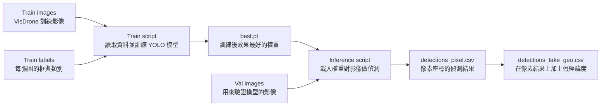
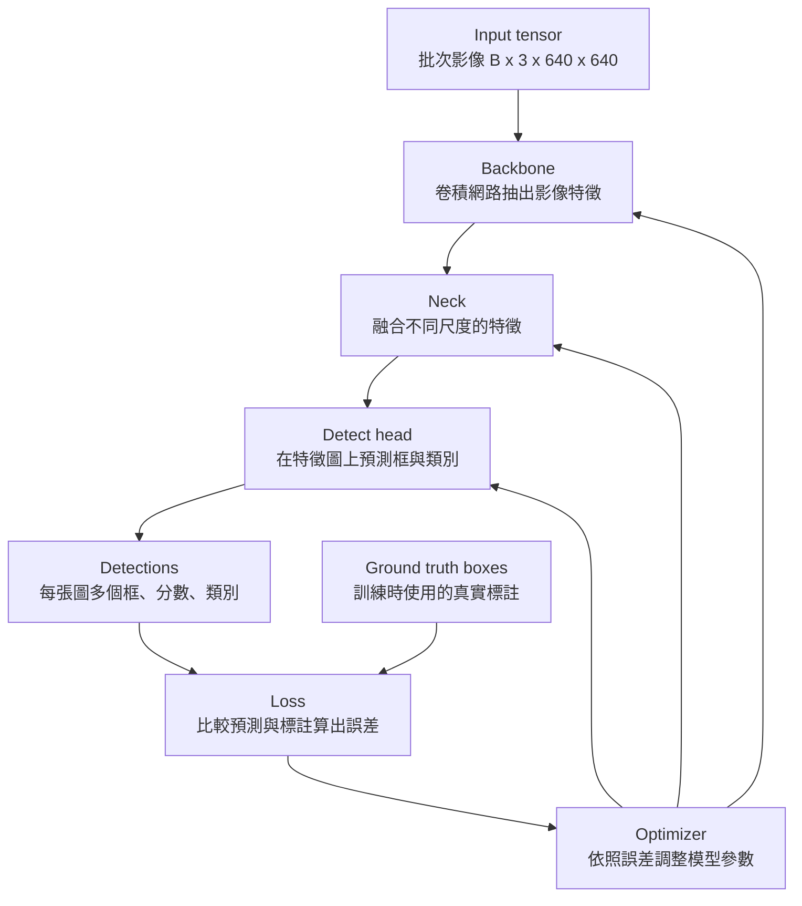

# YOLOv8n + VisDrone – Model and Workflow

## 1. Dataset, training and inference

```mermaid
flowchart LR
    TrainImgs["Train images<br/>VisDrone 訓練影像"]
    TrainLbls["Train labels<br/>每張圖的框與類別"]
    ValImgs["Val images<br/>用來驗證模型的影像"]

    TrainProc["Train script<br/>讀取資料並訓練 YOLO 模型"]
    Weights["best.pt<br/>訓練後效果最好的權重"]

    InferProc["Inference script<br/>載入權重對影像做偵測"]
    CsvPix["detections_pixel.csv<br/>像素座標的偵測結果"]
    CsvGeo["detections_fake_geo.csv<br/>在像素結果上加上假經緯度"]

    TrainImgs --> TrainProc
    TrainLbls --> TrainProc
    TrainProc --> Weights

    Weights --> InferProc
    ValImgs --> InferProc
    InferProc --> CsvPix
    CsvPix --> CsvGeo
```

## 2. YOLOv8n model structure (PyTorch)

```mermaid
flowchart TB
    Input["Input tensor<br/>批次影像 B x 3 x 640 x 640"]

    Backbone["Backbone<br/>卷積網路抽出影像特徵"]
    Neck["Neck<br/>融合不同尺度的特徵"]
    Head["Detect head<br/>在特徵圖上預測框與類別"]
    Output["Detections<br/>每張圖多個框、分數、類別"]

    GT["Ground truth boxes<br/>訓練時使用的真實標註"]
    Loss["Loss<br/>比較預測與標註算出誤差"]
    Optim["Optimizer<br/>依照誤差調整模型參數"]

    Input --> Backbone --> Neck --> Head --> Output

    GT --> Loss
    Output --> Loss
    Loss --> Optim
    Optim --> Backbone
    Optim --> Neck
    Optim --> Head
```