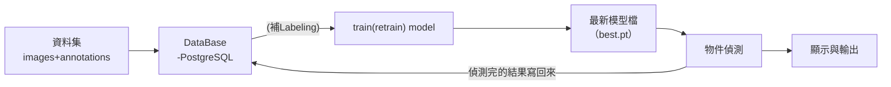

```mermaid
flowchart LR

    A["資料集<br/>images+annotations"]
    B["DataBase<br/>-PostgreSQL"]
    C["train(retrain) model"]
    D["最新模型檔<br/>（best.pt）"]
    E["物件偵測"]
    F["顯示與輸出"]

    %% 主流程：從圖片到偵測結果
    A --> B
    E -->|"偵測完的結果寫回來"| B

    %% Retrain 循環
    B -->|"(補Labeling)"| C
    C --> D
    D --> E

    %% 給使用者看的輸出
    E --> F
```